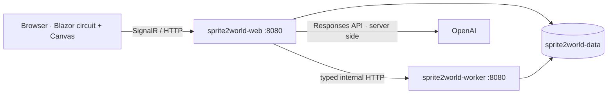
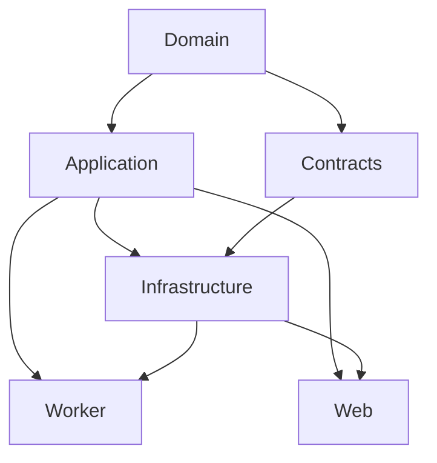

# Sprite2World architecture

## Decisions and risks

The largest product risks are malformed or unavailable AI output, unsafe archives, missing asset roles, nondeterministic maps, unreachable exits, UI blocking and accidental API-key disclosure. The architecture makes every AI output schema-constrained and application-validated, keeps tile placement outside the model, validates PNG and ZIP input, runs generation in a worker, and keeps credentials only in the web process.

The Compose network is internal. Only web port 8080 is mapped to host port 3000. Both runtime images use the built-in non-root .NET user. A named volume stores `projects/{id}/assets`, contact-sheet metadata, manifests and `project.json`.

## Project dependencies

- **Domain**: serializable models and rules; no ASP.NET/OpenAI dependency.
- **Application**: generator, validator, repair, demo blueprint and boundary interfaces.
- **Contracts**: versionable web/worker DTOs.
- **Infrastructure**: safe import, JSON storage, PNG codec/rendering, typed worker client and Responses API client.
- **Worker**: private minimal API for CPU/data operations.
- **Web**: Blazor editor, circuit state and OpenAI orchestration.

## Core flows

### Import

Browser files → bounded Blazor stream → base64 internal request → worker validates extension/size/path/PNG header → originals persisted → stable SHA-256 IDs and manifest returned → adaptive library renders originals as nearest-neighbor thumbnails.

ZIP entries are normalized before any write. The final absolute path must remain under the project asset root. Duplicate conflicting paths and extraction limits fail the entire request.

### AI design and deterministic engineering

1. Web sends the natural-language request to the OpenAI Responses API with `text.format.type=json_schema`, `strict=true`, and `store=false`.
2. The result is deserialized to the OpenAI-independent `SemanticBlueprint` and checked for schema version, supported world type, unique region IDs and valid references.
3. Worker converts semantic regions and connections to seeded rooms, corridors, walls, objects, collision cells, start and exit.
4. Validator independently performs grid flood-fill, region connectivity, overlap, collision, boundary and asset-reference checks.
5. Bounded repair removes blocking obstacles; failures remain visible with structured diagnostics.

The same blueprint, classifications, generator version and seed produce the same world. The model never supplies tile coordinates.

### Classification

Imported images are batched with stable IDs, paths and dimensions. OpenAI vision returns only allowed IDs and extensible role enums. Unknown/missing output remains editable. Any manual override sets confidence to 100% and is excluded from later AI updates.

### Playtest and export

Blazor passes the concrete world to a small JavaScript Canvas layer. It uses the collision grid for tile movement and camera following. Export JSON includes the complete manifest, blueprint, generator metadata, map, collisions and validation. The worker's dependency-free PNG encoder renders a complete diagnostic preview.

## Concise ADRs

1. **Two services, no broker** — typed synchronous HTTP is simpler and sufficient for bounded local MVP operations.
2. **JSON files, no database** — project-scoped writes and a named volume meet restart persistence without operational overhead.
3. **Direct REST integration** — `HttpClient` + `System.Text.Json` avoids an unnecessary SDK dependency and follows the Responses API's documented image-input and Structured Output shape.
4. **Dependency-free PNG path** — a small PNG encoder handles original demo assets and diagnostic export without a commercial or native image dependency. Imported originals remain unchanged.
5. **Offline deterministic fallback** — AI failures are visible, but they do not prevent a hackathon demo or engine validation.

## Extension points

Additional world grammars implement `IWorldGenerator`; future Tiled/Godot/Unity formats implement exporter boundaries; sprite slicing/contact-sheet compositing can replace the importer processing stage; session key handling can be added without exposing secrets to components. Authentication, public hosting, multiple floors and game systems remain outside Version 1.0.
